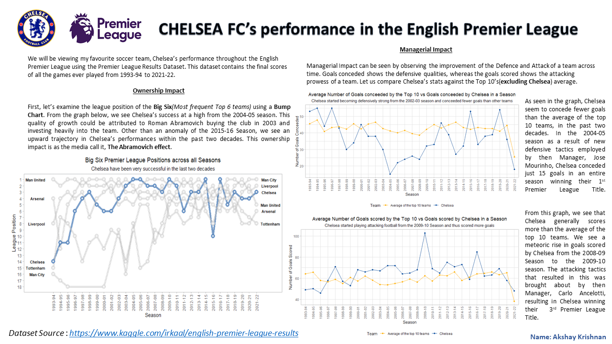

# ChelseaFC-PL-Analysis
Analysis of Chelsea FC's performance in the English Premier League 

I just wanted to see if any valuable insights could be derived by analysing my favourite English Premier League team, Chelsea FC.
The dataset used for this purpose is obtained from Kaggle - https://www.kaggle.com/datasets/irkaal/english-premier-league-results. The dataset contains the Premier League Results along with a lot of game analysis from the 1993-94 Season until the 2021-22 Season.
Data Dictionary is in the Datasets Folder - PL_Results_Data_Dictionary.xlsx

